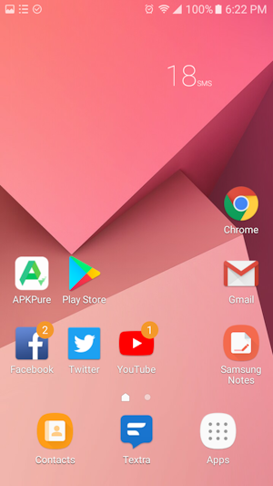
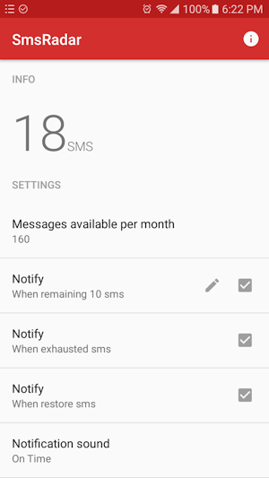

# SmsRadar
SmsRadar is an app that lets you know the number of sms sent in the month. Very useful for [SIM cards](https://en.wikipedia.org/wiki/SIM_card) that only have the messaging service available and are limited to send a number of sms per month

[Download](https://github.com/ypdieguez/SmsRadar/releases/download/1.0/SmsRadar_v1.0.apk)

## What does the app do
* It counts the sms sent by paging.
* It notifies when there are a few sms available.
* It notifies when the availables sms in the month are exhausted.
* It notifies when sms are restored at the beginning of the following month.
* It allows to choose the sound of the notification.
* It has a widget that shows the sms sent on the phone's home screen.

## Screenshot

## Contributing
You are more than welcome to help me improve this small project. :+1:

## Special mention
This app was made and has the same name thanks to the library [SmsRadar](https://github.com/tuenti/SmsRadar) :+1:

## License
    Copyright 2018 Yordan P. Dieguez

    Licensed under the Apache License, Version 2.0 (the "License");
    you may not use this file except in compliance with the License.
    You may obtain a copy of the License at

        http://www.apache.org/licenses/LICENSE-2.0

    Unless required by applicable law or agreed to in writing, software
    distributed under the License is distributed on an "AS IS" BASIS,
    WITHOUT WARRANTIES OR CONDITIONS OF ANY KIND, either express or implied.
    See the License for the specific language governing permissions and
    limitations under the License.
